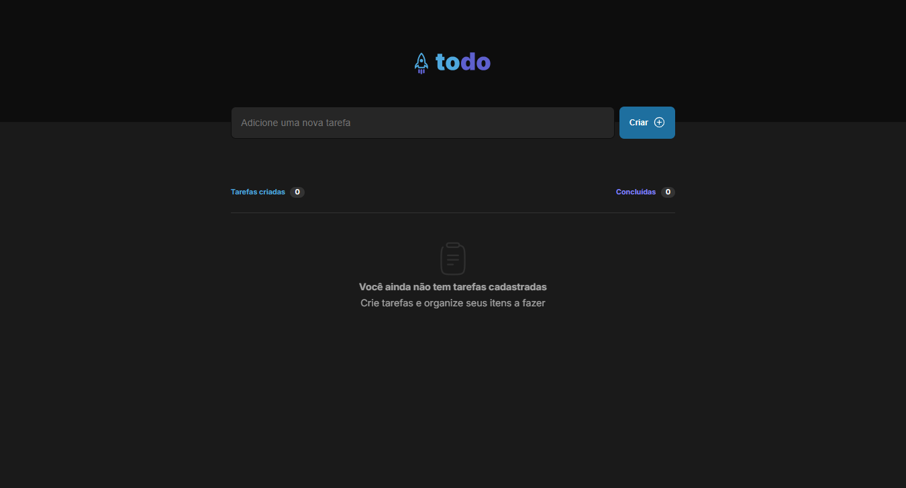
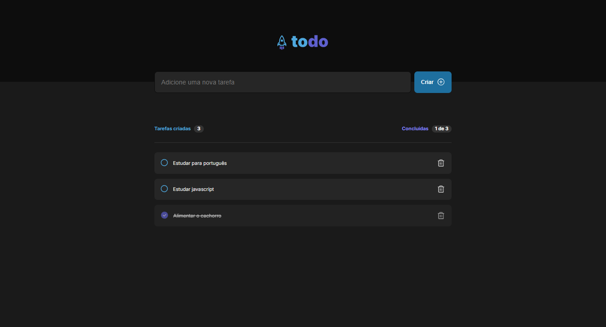

# 🚀 Todo List

Mais uma pequena aplicação de lista de tarefas, permite adicionar mais comentários e removê-los, apenas baseado em **estados** do React.

## 📑 Índice

- [Tecnologias Utilizadas](#️-tecnologias-utilizadas)
- [UI](#-ui)
- [Funcionalidades](#️-funcionalidades)
- [Como Rodar o Projeto](#️-como-rodar-o-projeto)
- [Agradecimentos](#️-fale-comigo)

## 🛠️ Tecnologias Utilizadas

### 🔎 Front-end

- **HTML/CSS** - Design do site e responsividade
- **Typescript** - Utilizado junto com o React, auxiliou na segurança do código
- **React** - Funções da aplicação

  

## 📷 UI

## ⚙️ Funcionalidades

- Criar tasks
- Apagar tasks
- Acompanhar o progresso de tasks

## 🚀 Como Rodar o Projeto

- Acesse ao link

  - 🔗 Link - [Todo List](https://jefolidev.github.io/todo-rocket/)

## 👥 Fale comigo!

Achou meu repertório interessante e gostaria de contratar um freela ou talvez me contratar para tornar acrescenter no seu negócio? Entre em contato comigo e vamos marcar.

  
  

